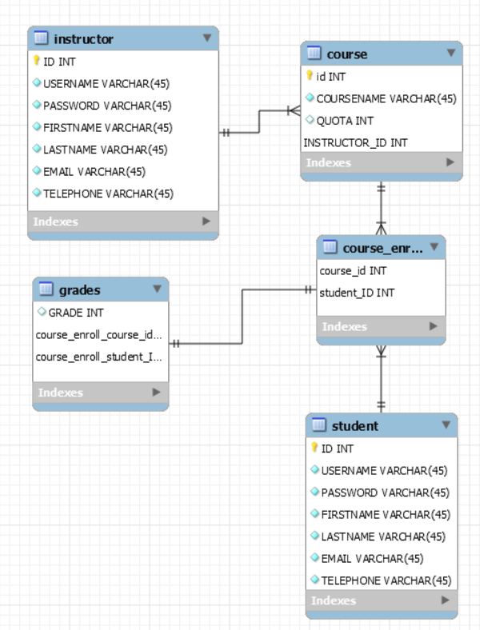

# Grade-System

Features

Admin can save,update,delete students and can view informations.
Admin can save,update,delete instructors and can view informations.

Instructors can save,delete,update,view courses and course grades.
Instructors can see students information.

Students can enroll a course if quota has free space.
Students can see courses enrolled and grades.

Database Schema

